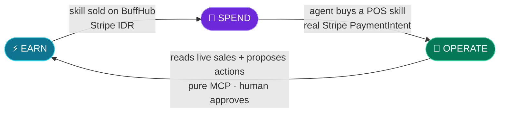
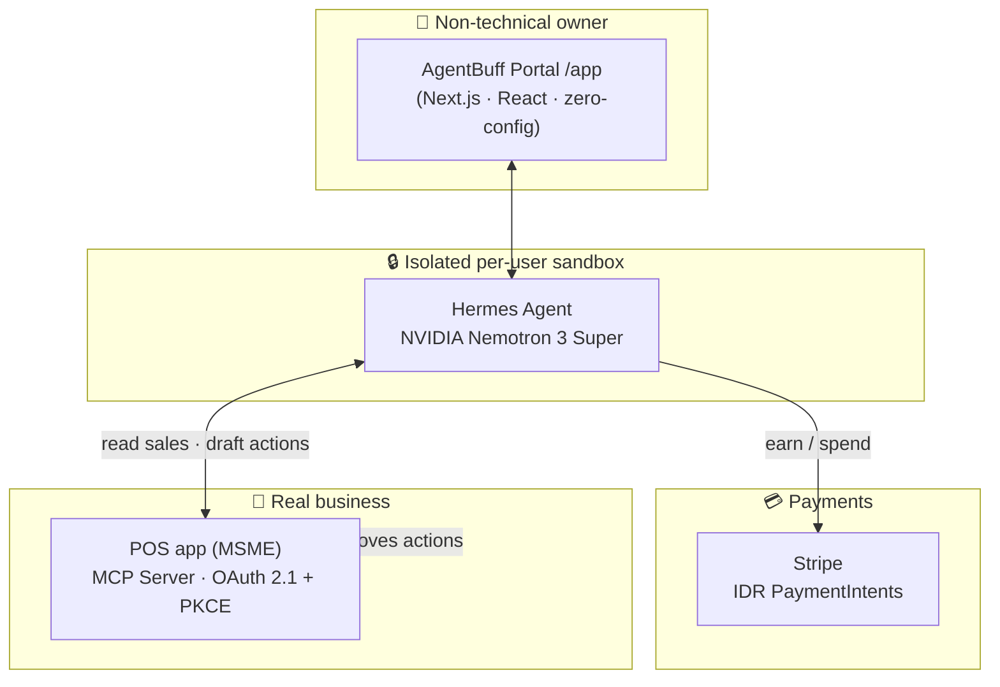

<div align="center">

# 🛡️ AgentBuff

### An AI worker that **earns, spends, and operates a real business** — for people who can't code.

*Going solo is hard — you carry everything alone.*
*Let **AgentBuff** carry your tasks. You just focus on leveling up.*

<br/>

[](https://nousresearch.com)
[](https://www.nvidia.com)
[-635BFF?style=for-the-badge&logo=stripe&logoColor=white)](https://stripe.com)
[](https://modelcontextprotocol.io)

[](https://nextjs.org)
[](https://www.typescriptlang.org)
[](#)

**Submission — Hermes Agent Accelerated Business Hackathon · Nous Research × NVIDIA × Stripe**

`#HermesAgent`

</div>

---

## 📍 TL;DR

**AgentBuff** is a no-code SaaS wrapper around **Nous' Hermes** agent. Every user gets their own isolated AI worker — powered by **NVIDIA Nemotron 3 Super** in this build — with **no terminal, no Docker, and no servers to run**. The user brings their own AI provider key (BYOK); AgentBuff handles the rest. We end the anomaly of local food-stall owners being forced to become software developers.

For this hackathon we closed the full **EARN → SPEND → OPERATE** loop: an agent that makes money, spends it autonomously through **Stripe**, and **operates a real Indonesian point-of-sale business over pure MCP**.

> 🎥 **Demo video:** https://x.com/cuanincuy/status/2071820970617422253

<div align="center">


</div>

---

## 🔁 The closed loop (what's new for this hackathon)



| Beat | What the agent does | Sponsor tech in play |
|------|--------------------|----------------------|
| ⚡ **EARN** | Gets paid **Rp 99.000** when a skill it published on the BuffHub marketplace is bought. | **Stripe** charge |
| 🛒 **SPEND** | *Autonomously* buys a **"Kasir POS UMKM"** skill with a real **Stripe PaymentIntent in IDR** (real customer + receipt). | **Stripe** PaymentIntent |
| 🏪 **OPERATE** | The moment it buys, it connects to a **real POS app over MCP** and pulls today's sales — **Rp 255.000 / 7 orders · best-seller Es Teh** — then proposes a business action a human approves. | **MCP** (OAuth 2.1 + PKCE) · **Nemotron 3** |

The agentic-commerce primitives are real: **Stripe handles the payments, MCP is the agent↔business bridge, Nemotron is the brain.**

---

## 🧩 The problem

Non-technical owners face extreme cognitive friction: a hyper-fragmented tool market and a flood of AI builders mean the average MSME owner is expected to wire up software just to run a stall, a kitchen, or a shop. They don't have a 24/7 server, Docker, or a terminal — and they shouldn't need them. AgentBuff runs the agent for them; the user just connects their own AI provider key (BYOK).

**AgentBuff abstracts all of it.** Register once → get your own always-on agent. Browse an Item Shop for skills instead of building anything. Pay in Rupiah. Never touch infrastructure.

---

## 🏗️ Architecture



- **Portal (this repo):** Next.js 16 + React 19 + Tailwind v4 — landing, auth, billing, marketplace, and the custom `/app` agent UI.
- **Engine:** Nous' Hermes agent, one isolated Docker container per user, running **NVIDIA Nemotron 3 Super**.
- **Payments:** Stripe — Indonesia-first, Rupiah PaymentIntents with real customer records.
- **Agent ↔ business:** the POS exposes its domain over **pure MCP** (read-only resources + human-in-the-loop draft tools). The agent never bypasses the human.

---

## 🛠️ Tech & sponsor stack

| Layer | Choice |
|-------|--------|
| **Agent engine** | Nous **Hermes** |
| **Model** | **NVIDIA Nemotron 3 Super** (`nemotron-3-super-120b-a12b`) |
| **Payments** | **Stripe** (IDR PaymentIntents + customers) |
| **Agent ↔ business bridge** | **Model Context Protocol** (OAuth 2.1 + PKCE, Resource Indicators) |
| **Portal** | Next.js 16 (App Router, Turbopack) · React 19 · TypeScript |
| **UI** | Tailwind CSS v4 · shadcn/ui · Framer Motion |
| **Data** | PostgreSQL + Drizzle ORM · NextAuth v5 |
| **Isolation** | One Docker container + volume per user, ICC-blocked network |

---

## 🔒 Safety & integrity (read before judging)

- **Stripe runs in TEST mode.** Every charge is a real Stripe API object (PaymentIntent, customer, receipt) in IDR — but no real funds move. We never claim real revenue.
- **Demo data is seeded sample data.** The POS is a real application, but the sales it reports (Rp 255.000 / 7 orders) are seeded sample transactions for the demo — not live customer revenue.
- **BYOK by design.** Users connect their own AI provider API key; AgentBuff removes the infrastructure burden (no terminal/Docker/servers), not the key. This keeps token cost and model choice in the user's control.
- **MCP is read-only + human-in-the-loop.** The agent can *read* the business and *draft* actions (price changes, restock, reminders), but a human approves them inside the POS app. There is intentionally **no** create/void-sale tool — that's the MCP safety boundary, by design.
- **Hard isolation.** Each user's agent runs in its own container + volume on an ICC-disabled network. The demo runs entirely in an isolated sandbox; **production is untouched.**
- **No secrets in this repo.** All keys live in environment variables (see [`.env.example`](.env.example)); nothing sensitive is committed.

---

## 🧱 What's new for the hackathon

The AgentBuff portal predates this event. **What we built for the hackathon is the closed earn → spend → operate loop and the MCP-connected real POS** the agent operates autonomously — the agentic-commerce layer on top of the existing product.

---

## 📂 Repo structure (high level)

```
src/app/            # Next.js routes — landing, auth, /app (agent UI), billing, API
src/components/app/ # The custom agent workspace (chat, agents, marketplace, channels)
src/lib/            # auth, db (Drizzle), billing, Hermes wiring, i18n
Docs/demo/          # Demo GIF (full earn -> spend -> operate walkthrough)
scripts/            # Dev + demo tooling
```

---

## ▶️ Running locally (overview)

> AgentBuff is a full SaaS portal + per-user Hermes containers, so a one-command run isn't the point — the **demo video** is the intended way to evaluate. For reference:

```bash
pnpm install
cp .env.example .env.local   # fill in your own keys (Stripe test, model provider, DB)
pnpm dev                     # custom Node server on http://localhost:617
```

---

## 🙏 Built with

**Nous Research** (Hermes) · **NVIDIA** (Nemotron 3 Super) · **Stripe** (agentic payments) · **Model Context Protocol**.

<div align="center">

**AgentBuff — an agentic business in anyone's hands.** 🇮🇩

`#HermesAgent`

</div>
